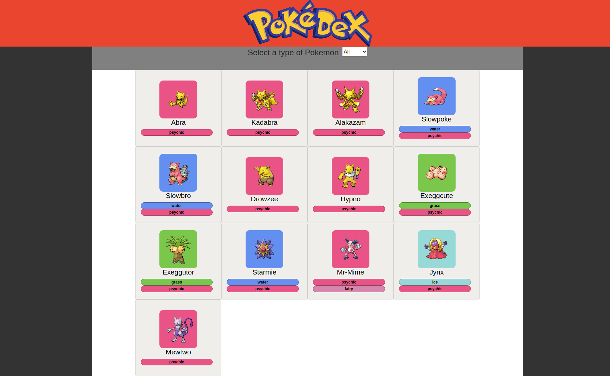
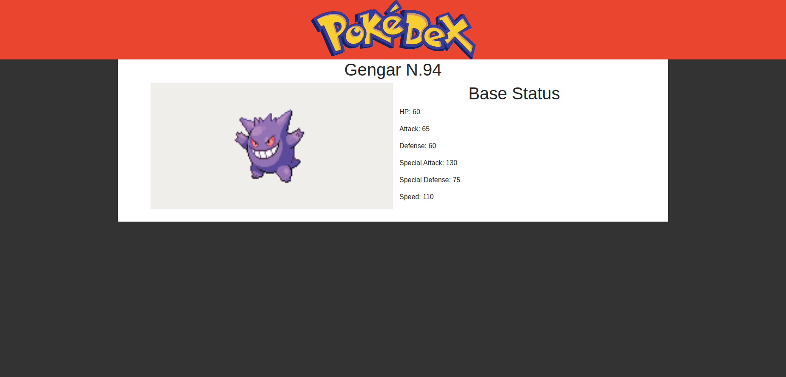

# React Redux Capstone: PokeDex

> This is a PokeDex webpage build with React & Redux using the Poke Api to fetch the data. You can see the Kanto pokemons and filter them by Type.
    You can click in each pokemo to see thier Stats.

- Home page where you can see all the pokemons.

- A more detail lookup to each pokemon.

## Built With

- React.js, Redux, Webpack, Babel
- Redux Toolkit
- HTML5/CSS3, Javascript ES6
- ESlint, Stylelint
- VSCode

## Live Demo @Netlify

[Live Demo Link](https://kanto-pokedex-yahir.herokuapp.com/)

## Video Demo @Loom

[Video Demo](https://www.youtube.com/watch?v=RyZK5H-qOtQ)

## Getting Started

- `git clone https://github.com/yahir91/Pokedex.git`
- `cd pokedex`
- `npm install`

## Available Scripts

### `npm start`

Runs the app in the development mode.\

### `npm run build`

Builds the app for production to the `build` folder.\
It correctly bundles React in production mode and optimizes the build for the best performance.

 

## 👤 Authors

👤 **Yahir Cardona**

- Github: [@yahir91](https://yahir91.github.io/yahir-cardona.github.io/)
- LinkedIn: [yahir-cardona](https://www.linkedin.com/in/yahir-cardona/)

## Show your support

Give a ⭐️ if you like this project!

## Acknowledgments

- Microverse
- etc